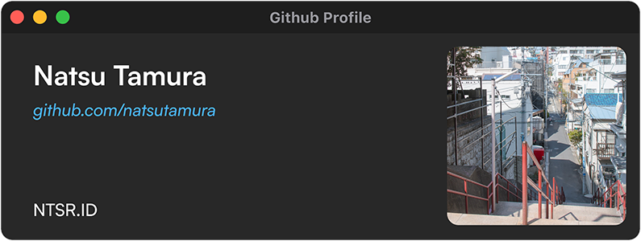

### Halo! Saya Ray 👋
Bukan Developer, hanya seorang desainer grafis.                                                               
[Kunjungi web saya disini](https://ntsr.site)

Aplikasi yang saya gunakan:
 - Adobe Photoshop
 - Figma
 - Illustrator (masih belajar 😁)
 - Adobe XD (masih belajar juga 😆)

 
 
 

<!--
-->
<!--
**natsutamura/natsutamura** is a ✨ _special_ ✨ repository because its `README.md` (this file) appears on your GitHub profile.

Here are some ideas to get you started:

- 🔭 I’m currently working on ...
- 🌱 I’m currently learning ...
- 👯 I’m looking to collaborate on ...
- 🤔 I’m looking for help with ...
- 💬 Ask me about ...
- 📫 How to reach me: ...
- 😄 Pronouns: ...
- ⚡ Fun fact: ...
-->
